<h1>Hi, I'm Rafael, but call me ilo </h1>

I like making things that are useful and a little bit chaotic, like a Discord bot that flirts with its users or a clean dashboard to keep that bot in line. Most of what I know, I learned by building it.

### What I'm building

- A fullstack web dashboard for managing Discord bots
- A Kuromi-themed Discord bot with an AI personality (work in progress)
- Small experiments with Hugging Face models and local LLMs

On the side: CTFs to learn cybersecurity, and Roblox Studio scripts when I just want to mess around.

### Stack

### Activity

  
  

### Find me

Discord: `aprctprince` 
Portfolio: coming soon

> _"Code is like humor. When you have to explain it, it's bad."_ (Cory House)
